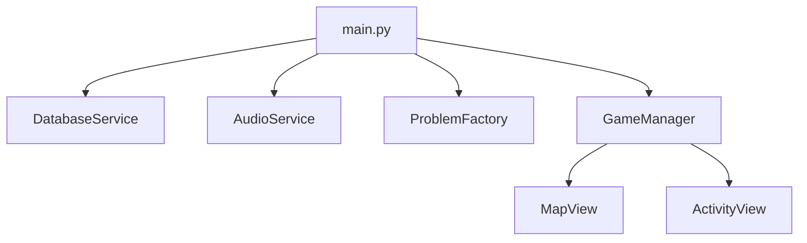

# Math Omni v2 - Complete Project Documentation

> **Exported:** 2025-12-30 | **Status:** V2 Production Architecture Complete

---

# Table of Contents
1. [Walkthrough (What Was Built)](#walkthrough)
2. [Task Checklist](#task-checklist)
3. [Implementation Plan](#implementation-plan)

---

<a name="walkthrough"></a>
# 1. Walkthrough - Production Architecture

## Architecture Overview
**Pattern:** Reading Eggs style Map → Activity → Reward loop  
**Tech:** PyQt6 + qasync + aiosqlite + edge-tts



## Files Modified

### Core Services

| File | Purpose |
|------|---------|
| `core/database.py` | Async SQLite for egg economy |
| `core/audio_service.py` | Non-blocking TTS with edge-tts |
| `core/problem_factory.py` | Linear difficulty scaling |

### UI Components

| File | Purpose |
|------|---------|
| `ui/game_manager.py` | Main controller (DI pattern) |
| `ui/map_view.py` | Level selection with async refresh |
| `ui/activity_view.py` | Question UI with debounce |

### Config

| File | Purpose |
|------|---------|
| `config.py` | Accessibility + economy constants |
| `main.py` | Async entry point with qasync |

## Key Design Decisions

### 1. Dependency Injection
```python
# main.py passes services to GameManager
window = GameManager(db, audio, factory)
```

### 2. Async-First Pattern
```python
# All DB/audio operations are async
self.current_eggs = await self.db.add_eggs(REWARD_CORRECT)
await self.audio.speak("Great job!")
```

### 3. Rage-Click Protection
```python
# 300ms debounce in ActivityView
if self._interaction_locked:
    return
self._interaction_locked = True
```

### 4. 96px Touch Targets
```python
btn.setFixedSize(MIN_TOUCH_TARGET, MIN_TOUCH_TARGET)  # 96px
```

## Run Command
```powershell
cd math-omni-foundation
.\venv\Scripts\python.exe main.py
```

## Verification Status
✅ App launches without errors  
✅ Map view displays with level buttons  
⏳ TTS playback (requires testing)  
⏳ Egg persistence (requires testing)

---

<a name="task-checklist"></a>
# 2. Task Checklist

## Upgrade Steps
- [x] 1. Update `requirements.txt`
- [x] 2. Update `config.py` (cleaner structure)
- [x] 3. Create async `DatabaseService`
- [x] 4. Update `ProblemFactory`
- [x] 5. Update `AudioService` (subprocess playback)
- [x] 6. Rewrite `main.py` (async init)
- [x] 7. Update `GameManager` (async patterns)
- [x] 8. Update `ActivityView` (debounce)
- [x] 9. Update `MapView` (async refresh)

## Testing
- [x] App launches without errors
- [ ] TTS plays without blocking UI
- [ ] Egg economy persists
- [ ] Level progression works

---

<a name="implementation-plan"></a>
# 3. Implementation Plan

## Overview

**Pivot**: From drawing-based AI interpretation → Tap-based deterministic gamification (Reading Eggs model)

**Core Loop**: `Map → Lesson (9 Activities) → Quiz → Reward → Repeat`

## Token Economy Specification

### Earning (Inflow)

| Action | Eggs | Source |
|--------|------|--------|
| Correct answer | **4** | Per mini-game answer |
| Activity complete | 10 | Short-term closure |
| Lesson complete | 14-42 | Variable by lesson length |
| Map complete (10 lessons) | 50 bonus | Treasure chest unlock |

### Spending (Sinks)

| Item Type | Cost | Answers Required |
|-----------|------|------------------|
| Basic avatar item | 100 | ~25 correct answers |
| Premium outfit | 250 | Multi-session goal |
| Arcade game play | 50 | Trade-off decision |
| House decoration | 150-400 | Status/ownership |

> **Verified Ratio**: **1:25** (one correct answer ≈ 4% of a basic item)

## Accessibility Constraints

### Touch Targets
- **Minimum**: 44-48dp (≈7-9mm physical)
- **For children**: 80px+ recommended (≈1.5cm physical)
- **Spacing**: 8-10mm between targets (16-24px)

### Typography (Dyslexia-Friendly)
- **Body text**: 18-24px (≈14-18pt)
- **Fonts**: Sans-serif only (Comic Sans, Lexend, Sassoon, Verdana)
- **Avoid**: Italics, all-caps, ornate fonts

### Color
- **Avoid**: Pure black (#000) on pure white (#FFF)
- **Recommended**: Dark charcoal (#2B2B2B) on soft pastel (#FFFEF0)
- **Contrast ratio**: 4.5:1 minimum (WCAG AA)

## Folder Structure

```
math-omni-foundation/
├── main.py              # Async entry point
├── config.py            # UI + economy constants
├── requirements.txt
├── core/
│   ├── database.py      # Async SQLite
│   ├── audio_service.py # edge-tts
│   └── problem_factory.py
├── ui/
│   ├── game_manager.py  # Main controller
│   ├── map_view.py      # Level selection
│   └── activity_view.py # Question UI
├── cache/audio/         # TTS cache
└── data/math_omni.db    # SQLite database
```

## Dependencies

```
PyQt6
qasync>=0.28.0
aiosqlite>=0.22.1
edge-tts
numpy
```

---

*End of consolidated documentation*
